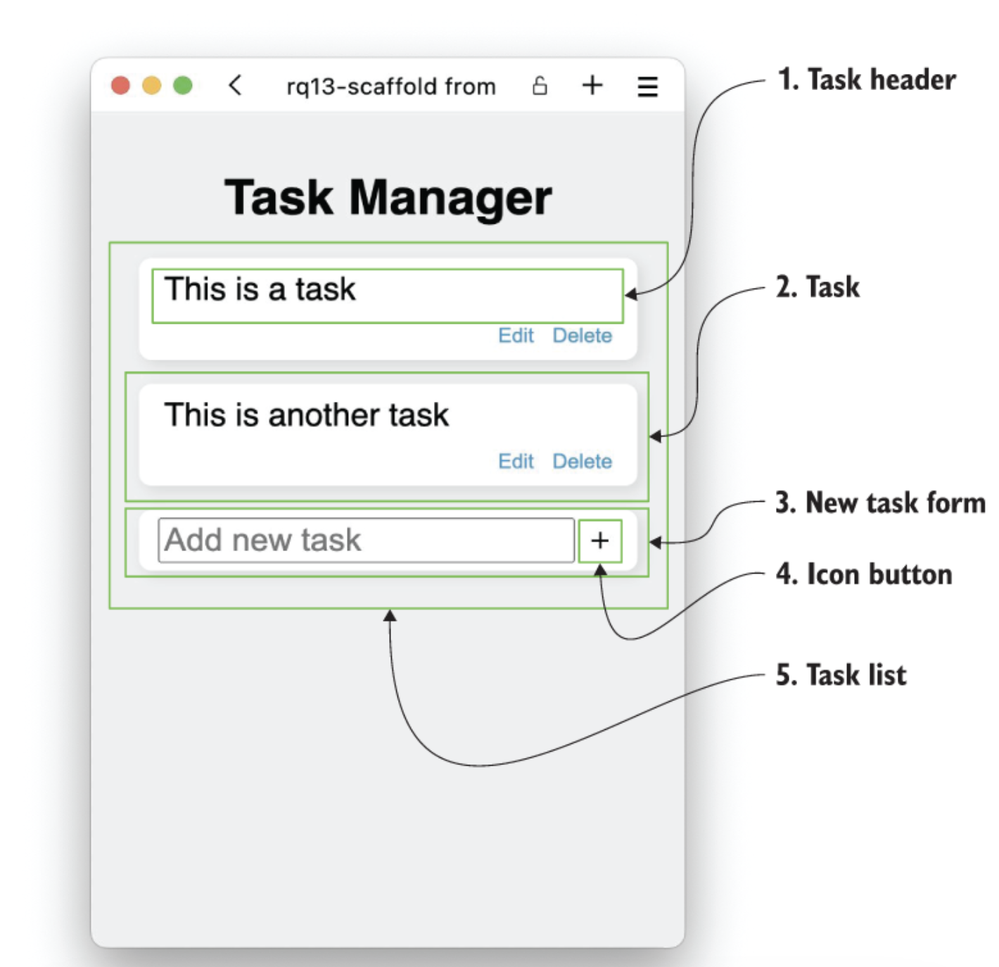

# Task Manager Project

A React-based task management application built in 5 progressive steps, incorporating various React concepts and APIs.

## Project Overview

This project is a task manager application that evolves through 5 distinct development steps, each adding new features and complexity while introducing different React concepts.

## Development Steps

### Step 1: Scaffold (⭐)
- Create basic component structure for task list
- Implement form for adding new tasks
- Uses functional components with JSX
- **React Concepts**: Functional components, JSX

### Step 2: List (⭐⭐⭐)
- Convert static structure to dynamic task list using state
- Add functionality for editing tasks
- Implement task deletion feature
- **React Concepts**: State management, Events, Forms

### Step 3: Steps (⭐⭐⭐⭐)
- Add sub-steps and progress tracking to each task
- Implement step completion functionality
- Create accordion-style task list (one task expanded at a time)
- Add step deletion capability
- **React Concepts**: Context API

### Step 4: Priority (⭐⭐⭐⭐)
- Implement task prioritization through reordering
- Convert state management to use reducer pattern
- Add custom hooks for state management
- **React Concepts**: Reducer pattern, Custom hooks

### Step 5: Dragging (⭐⭐⭐⭐⭐)
- Enable drag-and-drop functionality for task reordering
- Replace arrow-based priority system with drag interface
- Implement smooth animations for drag operations
- **React Concepts**: Event handlers, Drag-and-drop API

## Technical Requirements

- React.js
- Modern JavaScript (ES6+)
- CSS for styling
- Familiarity with React hooks and state management

## Getting Started

1. Clone the repository
2. Install dependencies with `npm install`
3. Start the development server with `npm start`
4. Follow each step's implementation guide in the source code

## Learning Objectives

- Master React functional components
- Understand state management patterns
- Work with React Context API
- Implement reducers and custom hooks
- Handle complex user interactions
- Build accessible drag-and-drop interfaces

---

## The goal of this exercises
In this step of the project, we’ll add the actual functionality to the structure that was outlined in the scaffold. After completing this step, we want to have a simple task manager that can do the following:

- Show a list of tasks
- Allow the user to add a new task by writing the task title
- Allow the user to delete a task
- Allow the user to rename a task

We’ll do this in two steps:
1. Split the single big component into multiple smaller components that make sense in terms of component size, responsibility, and visual representation
2. Make the application stateful, so it starts with a predefined list, and users can then append, delete, and update tasks as they see fit.

### Component hierarchy


[Source code and final demo](https://reactquickly.dev/browse/ch13/rq13-list/try)

---

## Step List
Link Demo: https://reactquickly.dev/browse/ch13/rq13-dragging/try


Step List component
```jsx
import React from "react";
import dragIcon from "./assets/drag.svg";
import trashIcon from "./assets/trash.svg";
import pencilIcon from "./assets/pencil.svg";
import upIcon from "./assets/up.svg";
import downIcon from "./assets/down.svg";
import plusIcon from "./assets/plus.svg";

const fakeSteps = [
  { id: 1, title: "Step 1", completed: false },
  { id: 2, title: "Step 2", completed: false },
  { id: 3, title: "Step 3", completed: false },
];

// Step component for individual steps
const Step = ({ step, onEdit, onDelete, onMoveUp, onMoveDown }) => {
  return (
    <li draggable="true" className="step">
      <span className="icon-button step-button step-handle">
        
      </span>

      <label className="step-label">
        <input type="checkbox" checked={step.completed} />
        {step.completed ? <s>{step.title}</s> : step.title}
      </label>

      <button className="icon-button step-button" onClick={onEdit}>
        
      </button>

      <button className="icon-button step-button" onClick={onDelete}>
        
      </button>

      <button className="icon-button step-button" onClick={onMoveUp}>
        
      </button>

      <button className="icon-button step-button" onClick={onMoveDown}>
        
      </button>
    </li>
  );
};

// AddStep component for the form to add new steps
const AddStep = ({ onAdd }) => {
  const handleSubmit = (e) => {
    e.preventDefault();
  };

  return (
    <li className="step add-step">
      <form className="step-form" onSubmit={handleSubmit}>
        <input className="step-input" placeholder="Add new step" name="step" />
        <button className="icon-button step-button">
          
        </button>
      </form>
    </li>
  );
};

// Main StepList component
const StepList = () => {
  return (
    <section className="progress">
      <ol className="progress-steps">
        {fakeSteps.map((step) => (
          <Step
            key={step.id}
            step={step}
            onEdit={() => {}}
            onDelete={() => {}}
            onMoveUp={() => {}}
            onMoveDown={() => {}}
          />
        ))}
        <AddStep />
      </ol>
    </section>
  );
};

export default StepList;

```